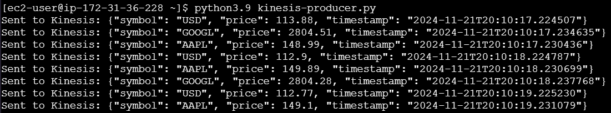
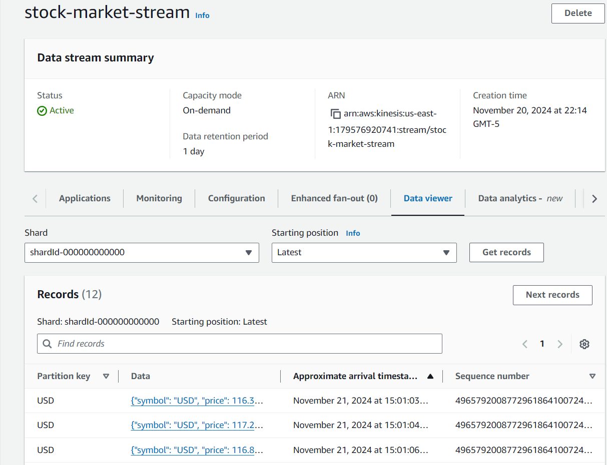

# Módulo 1: Generación de datos (EC2 y Kinesis Data Streams)

## Despliegue de la API

Para la generación de datos, se desplegará una API en una instancia de EC2 que constantemente estará enviando datos ficticios de precios de acciones a un flujo de Kinesis Data Streams.

### Pasos a seguir

1. **Creación de la instancia de EC2**

   - Ingresar a la consola de AWS y dirigirse al servicio de EC2.
   - Hacer clic en el botón "Launch Instance" para lanzar una nueva instancia.
   - Seleccionar una `Amazon Linux 2 AMI` y elegir una instancia `t2.micro`.
   - En la configuración de instancias, agregar una regla de seguridad para permitir el tráfico `HTTP`.
   - Descargar el par de claves y lanzar la instancia.

2. **Conexión a la instancia**

   - Conectarse a la instancia de EC2 mediante SSH.

3. **Instalación de Docker**

   - Actualizar los paquetes de la instancia con el comando.

     ```bash
     sudo yum update -y
     ```

   - Instalar Docker y Docker Compose con el siguiente comando.

     ```bash
     sudo amazon-linux-extras install docker
     ```

   - Iniciar el servicio de Docker con el comando.

     ```bash
     sudo systemctl enable docker
     sudo systemctl start docker
     ```

   - Agregar el usuario al grupo de Docker con el comando.

     ```bash
     sudo usermod -a -G docker ec2-user
     ```

   - Cerrar la sesión y volver a conectarse a la instancia.
   - Instalar Docker Compose con el siguiente comando.

     ```bash
     sudo curl -L https://github.com/docker/compose/releases/latest/download/docker-compose-$(uname -s)-$(uname -m) -o /usr/local/bin/docker-compose
     sudo chmod +x /usr/local/bin/docker-compose
     docker-compose version
     ```

4. **Despliegue de la API**

   - Crear un archivo `docker-compose.yml` con el siguiente contenido.

     ```yaml
     services:
       api:
         image: msosav/stock-market-shares:latest
         ports:
           - "80:80"
         restart: always
     ```

   - Correr el contenedor con el comando.

     ```bash
     docker-compose up -d
     ```

5. **Verificación de la API**

   - Acceder a la dirección IP pública de la instancia de EC2 en un navegador.
   - Verificar que la API esté funcionando correctamente yendo a la ruta `/stocks/USD`.

    <div align="center">
        
    </div>

## Configuración de Kinesis Data Streams

Para la configuración de Kinesis Data Streams, se creará un flujo de datos que recibirá los datos de la API desplegada en la instancia de EC2.

### Pasos a seguir

1. **Creación del flujo de Kinesis Data Streams**

   - Ingresar a la consola de AWS y dirigirse al servicio de Kinesis.
   - Hacer clic en el botón "Create data stream".
   - Llamar al flujo de datos `stock-market-stream`.
   - Crear el flujo de datos.

2. **Configuración del entorno**

   - Instalar Python 3.9.

     ```bash
     sudo yum install gcc openssl-devel bzip2-devel libffi-devel -y
     cd /opt
     wget https://www.python.org/ftp/python/3.9.16/Python-3.9.16.tgz
     tar xzf Python-3.9.16.tgz
     cd Python-3.9.16
     sudo ./configure --enable-optimizations
     sudo make altinstall
     export PATH="/usr/local/bin:$PATH"
     ```

   - Instalar las dependencias necesarias.

     ```bash
     pip3.9 install boto3 requests
     ```

3. **Autenticarse con AWS**

   - Crear un archivo `credentials` en la carpeta `~/.aws` con las credenciales de AWS.

     ```bash
     mkdir ~/.aws
     touch ~/.aws/credentials
     ```

   - Agregar las credenciales de AWS al archivo `credentials`.

     > [!NOTE]
     > Se encuentran en "Launch AWS Academy Learner Lab" > "AWS Details" > "Cloud Access" > "AWS CLI"

4. **Manejo de los datos**

   - Crear un archivo `kinesis-producer.py` con el siguiente contenido.

     ```python
     import json
     import requests
     import boto3
     import time

     KINESIS_STREAM_NAME = "stock-market-stream"
     REGION_NAME = "us-east-1"

     kinesis_client = boto3.client("kinesis", region_name=REGION_NAME)

     symbols = ["USD", "AAPL", "GOOGL"]

     def send_to_kinesis(data: dict, partition_key: str):
         try:
             data_json = json.dumps(data)

             response = kinesis_client.put_record(
                 StreamName=KINESIS_STREAM_NAME,
                 Data=data_json,
                 PartitionKey=partition_key
             )
             print(f"Enviado a Kinesis: {data_json}")
             return response
         except Exception as e:
             print(f"Error al enviar a Kinesis: {e}")

     def consume_stock_data(symbol: str):
         url = f"http://localhost/stocks/{symbol}"
         try:
             response = requests.get(url, stream=True)

             for line in response.iter_lines():
                 if line:
                     data = json.loads(line.decode('utf-8'))
                     send_to_kinesis(data, symbol)
                     time.sleep(1)

         except requests.exceptions.RequestException as e:
             print(f"Error al consumir el endpoint {symbol}: {e}")

     def main():
         for symbol in symbols:
             consume_stock_data(symbol)

     if __name__ == "__main__":
         main()
     ```

   - Ejecutar el script `kinesis-producer.py` con el siguiente comando.

     ```bash
     python3.9 kinesis-producer.py
     ```

     <div align="center">
         
     </div>

5. **Verificación de los datos**

   - Ingresar a la consola de Kinesis y seleccionar el flujo de datos creado.
   - Verificar que los datos estén llegando correctamente al flujo de Kinesis.

     <div align="center">
         
     </div>
