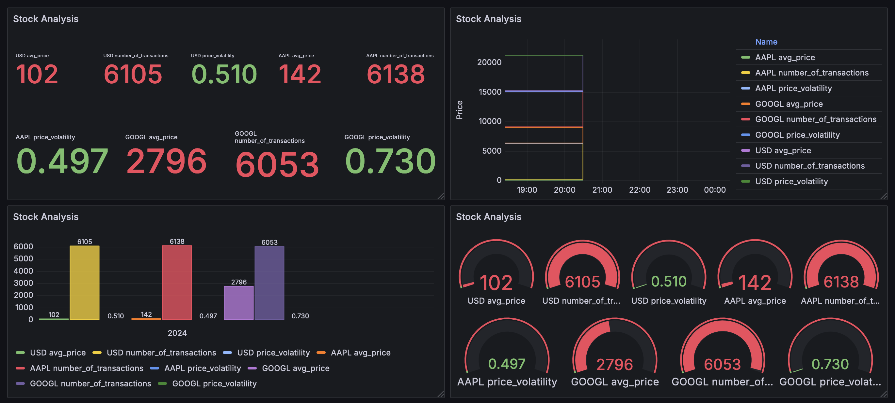

# Módulo 4: Análisis y visualización (Amazon Athena y Grafana)

## Creación de la base de datos y la tabla en Amazon Athena

### Pasos a seguir

1. **Creación de la base de datos en Amazon Athena**

   - Ingresar a la consola de AWS y dirigirse al servicio de Amazon Athena.
   - Hacer clic en la opción `Consulte sus datos con Trino SQL` y luego en iniciar el editor de consultas.
   - Escribir la siguiente query en el editor:
   
    ```
    CREATE DATABASE stock_analysis;
    ```

   - Dar clic en `Ejecutar`.

2. **Creación de la tabla externa**

   - Eliminar la query anterior y escribir la siguiente query en el editor: 

    ```
    CREATE EXTERNAL TABLE stock_prices (
    symbol STRING,
    price DOUBLE,
    timestamp TIMESTAMP,
    day DATE
    )
    ROW FORMAT SERDE 'org.openx.data.jsonserde.JsonSerDe'
    LOCATION 's3://stock-market-data-msosav/processed/';
    ```

   - Dar click en ejecutar.

## Instalación de Grafana en una máquina EC2

### Pasos a seguir

1. **Creación de la instancia EC2**

   - Ingresar a la consola de AWS y dirigirse al servicio de Amazon EC2.
   - Hacer clic en el botón `Lanzar instancias`.
   - Parámetros de la instancia:
    ```
    Nombre: A elección.
    AMI: Ubuntu Server 24.04 LTS.
    Tipo de instancia: t2.micro.
    Configuraciones de red:
        - Asignar automaticamente la IP pública (Habilitar).
        - Permitir el tráfico SSH desde 0.0.0.0/0.
        - Permitir el tráfico HTTPS desde Internet.
        - Permitir el tráfico HTTP desde Internet.
    Grupo de seguridad:
        - Abrir los siguientes puertos TCP: 3000, 22, 443, 80.
    ```

   - Dar clic en el botón `Lanzar instancia`.

2. **Instalar Grafana en la máquina creada**

   - Conectarse por SSH a la máquina y ejecutar los siguientes comandos:

    ```bash
    sudo apt-get update
    sudo apt-get install -y apt-transport-https software-properties-common
    sudo add-apt-repository "deb https://packages.grafana.com/oss/deb stable main"
    wget -q -O - https://packages.grafana.com/gpg.key | sudo apt-key add -
    sudo apt-get update
    sudo apt-get install grafana
    sudo systemctl start grafana-server
    sudo systemctl enable grafana-server
    ```

## Configuración de una fuente de datos en Grafana

### Pasos a seguir

1. **Configurar una nueva conexión**

   - Accede a Grafana `http://ip-de-la-instancia:3000`.
   - Escribe las credenciales por defecto: admin/admin.
   - Da clic en `Connections`.
   - Buscar Amazon Athena y dar clic allí.
   - Dar click en `Install plugin` y esperar que instale.

2. **Crear una nueva fuente de datos**

   - Dar click en `Add new data source`.
   - Parámetros de la fuente de datos:
    ```
    Nombre: A elección
    Authentication Provider: AWS SDK Default
    Default Region: us-east-1
    Data source: AwsDataCatalog
    Database: stock_analysis
    Workgroup: primary
    Output Location: s3://stock-market-data-msosav/analysis-results/
    ```
   No modificar los otros parámetros.
   - Dar click en `Save & test`.

## Creación de un dashboard

### Pasos a seguir

1. **Crear dashboard y agregar visualización**

   - Dar clic en `Build a dashboard`.
   - Dar clic en `Add visualization`.
   - Seleccionar la fuente de datos recién creada: `grafana-athena-datasource`.
   - Escribir la siguiente query:
    ```
    SELECT 
        date_trunc('hour', "timestamp") as time,
        AVG(price) as avg_price,
        COUNT(*) as number_of_transactions,
        STDDEV(price) as price_volatility
    FROM 
        stock_prices 
    WHERE 
        symbol = 'USD'
        AND "timestamp" BETWEEN 
            date_trunc('day', current_date - interval '7' day)
            AND current_timestamp
    GROUP BY 
        date_trunc('hour', "timestamp")
    ORDER BY 
        time
    ```
   - Dar clic en `Run query`.
   - Dar clic en `Add query` copiar y pegar la misma query cambiando la variable symbol por `AAPL`.
   - Dar clic en `Run query`.
   - Dar clic en `Add query` copiar y pegar la misma query cambiando la variable symbol por `GOOGL`.
   - Dar clic en `Run query`.
   - Escribir `Stock Analysis` en el campo Title de Panel Options.
   - Dar clic en `Save dashboard`.
   - Se pueden agregar más visualizaciones si se requiere

### Dashboard final

<div align="center">
    
</div>